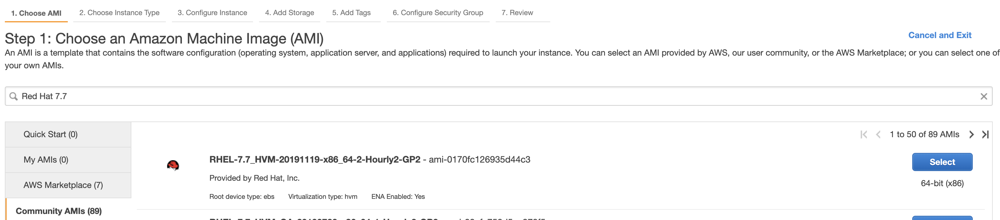
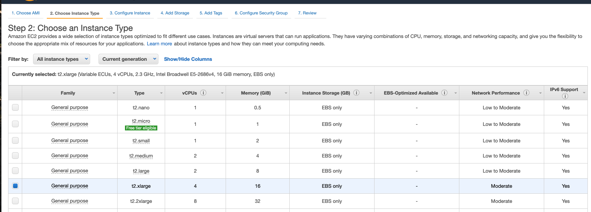
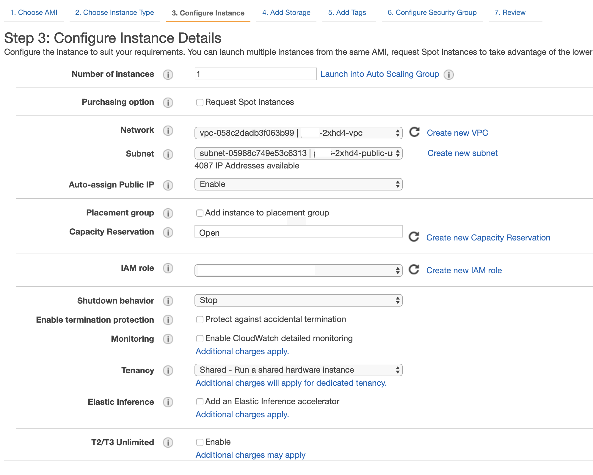
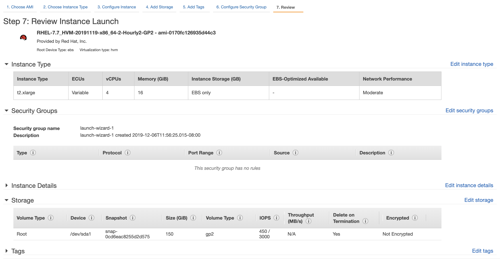
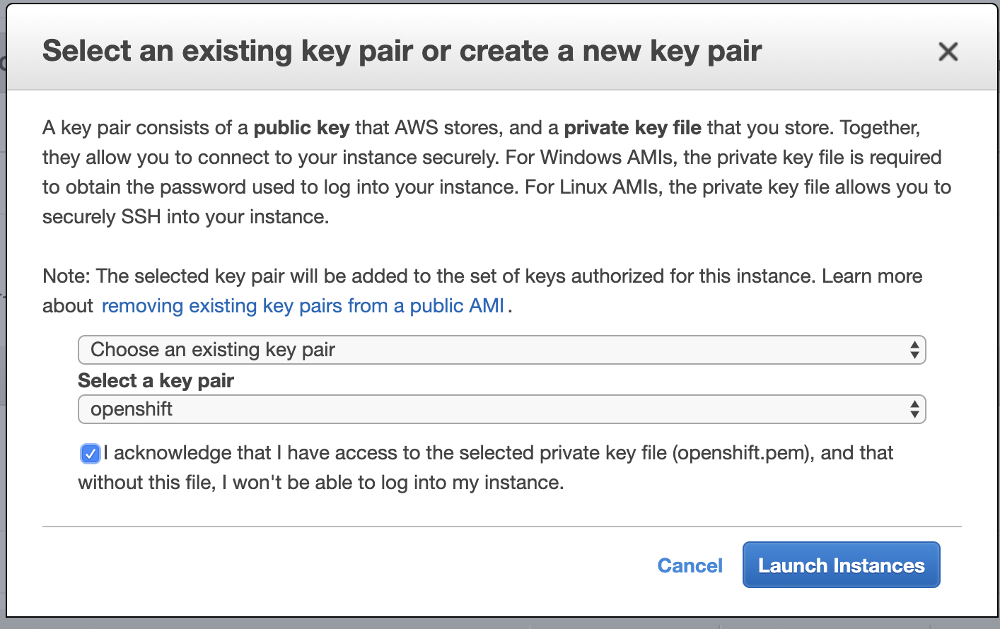
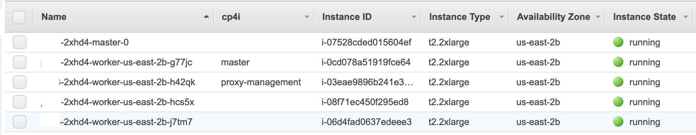

# Install Cloud Pak for Integration 2019.4.1.1 with OpenShift 4.2 on AWS

This document will walk through the setup processs of a **non-HA development** environment of Cloud Pak for Integration. This is **not** recommended for production.

>**You are responsible for the cost of the AWS services used while running this deployment.**

For the purpose of this guide the AWS region will be `us-east2` and the cluster will be deployed exclusively in availability zone `us-east-2b`.

> The [Installing a cluster quickly on AWS](https://docs.openshift.com/container-platform/4.2/installing/installing_aws/installing-aws-default.html) guide is **NOT** recommended to install CP4I. It provisions a very small HA cluster with not enough resources.

This guide uses the **offline** installer of Cloud Pak for Integration. This installer is recommended for sites where there is no internet connection. There is an **online** installer that is considerable smaller and faster, for instructions on how to install CP4I with the online installer use [this link](https://www.ibm.com/support/knowledgecenter/SSGT7J_19.4/install/install_online.html).

## Prerequisites

1. Follow the steps to configure the AWS account from the [OpenShift Installing AWS Page](https://docs.openshift.com/container-platform/4.2/installing/installing_aws/installing-aws-account.html)

1. This guide uses the following parameters:
    - Install directory: `dev` (located at the same path than the `openshift-install` executable.
    - Domain: `cloud.mydomain.com`
    - Cluster name: `dev`

## OpenShift 4.2

> The `install-config.yaml` file will be **deleted** as soon as you start the installation of OpenShift. If you have an interest in reusing it make sure you have a copy in another location.

All of this steps should be done in your local machine. macOS Catalina 10.15.1 was used to create this guide.

1. Read and perform the steps below directly from the official OpenShift Guide
    - [Generating an SSH private key and adding it to the agent](https://docs.openshift.com/container-platform/4.2/installing/installing_aws/installing-aws-customizations.html#ssh-agent-using_installing-aws-customizations)
    - [Obtaining the installation program](https://docs.openshift.com/container-platform/4.2/installing/installing_aws/installing-aws-customizations.html#installation-obtaining-installer_installing-aws-customizations)
    - [Installing the CLI](https://docs.openshift.com/container-platform/4.2/installing/installing_aws/installing-aws-customizations.html#cli-installing-cli_installing-aws-customizations)

1. Generate the installation configuration file.

    ```bash
    $ ./openshift-install create install-config --dir=./dev
    ? SSH Public Key /Users/user/.ssh/id_rsa.pub
    ? Platform aws
    ? Region us-east-2
    ? Base Domain cloud.mydomain.com
    ? Cluster Name dev
    ? Pull Secret *******************
    ```

1. Review the [install-config.yaml](./resources/install-config.yaml) file recommended for this installation and adjust the paramenters to deploy a cluster needed for CP4I. If you want to learn more about the paramaters supported for AWS go to the [Installation configuration parameters](https://docs.openshift.com/container-platform/4.2/installing/installing_aws/installing-aws-customizations.html#installation-configuration-parameters_installing-aws-customizations)

1. Edit the `install-config.yaml` located inside the `dev` folder.

1. To create the cluster infrastructure and install OpenShift run the command:

    ```bash
    ./openshift-install create cluster --dir=./dev --log-level=info
    ```

1. Validate that the cluster was deployed properly.
    - The install script will out the cluster console URL, the user and password needed to authenticate.
    - Ensure the access from the `oc` CLI. [Logging in to the cluster](https://docs.openshift.com/container-platform/4.2/installing/installing_aws/installing-aws-customizations.html#cli-logging-in-kubeadmin_installing-aws-customizations)

> Since this install only has one master 2 `etcd-quorum-guard` pods will be in pending state and will not work properly. The purpose of these pods are to maintan quorum for etcd. It expects at least 2 master nodes to be available to work properly. To scale down the deployment and avoid this run the following commands:

```bash
$ oc patch clusterversion/version --type='merge' -p "$(cat <<- EOF
spec:
  overrides:
    - group: apps/v1
      kind: Deployment
      name: etcd-quorum-guard
      namespace: openshift-machine-config-operator
      unmanaged: true
EOF
)"
clusterversion.config.openshift.io/version patched

$ oc scale --replicas=1 deployment/etcd-quorum-guard -n openshift-machine-config-operator
deployment.extensions/etcd-quorum-guard scaled
```

## Cloud Pak for Integration 2019.4.1.1

> Since the OpenShift installer creates and destroys the bastion node that installs the cluster a new node will be created. Make sure this instance is created in the same VPC as the rest of the cluster.

### Boot node creation

1. Create a Boot node on AWS. In this guide we are using `RHEL-7.7_HVM-20191119-x86_64-2-Hourly2-GP2` AMI from the AWS Community AMIs.

    

1. Select `t2.xlarge` as the instance type. Proceed to **Next: Configure Instance Details**

    

1. Override the following settings for the node. Proceed to **Next: Add Storage**
    - Network: Select the VPC created for your OpenShift Cluster
    - Subnet: Select the public subnet
    - Auto-assign Public IP: Enable

    

1. Increase the Root volume size to `150 GiB`. Proceed to **Review and Launch**

1. Your configuration should look something like this. If it's correct. Proceed to **Launch**

    

1. Create a new key pair or select an existing one. Proceed to **Launch Instance** and wait a few minutes for the instance to boot.

    

### Boot node software install

1. SSH into the boot node and become the `root` user

    ```console
    ssh -i "openshift.pem" ec2-user@ec2-10-0-0-0.us-east-2.compute.amazonaws.com
    sudo -s
    ```

1. Register your node with RedHat using the subscription manager and attach the machine to a pool.

    ```console
    $ subscription-manager register
    Registering to: subscription.rhsm.redhat.com:443/subscription
    Username: redhat.username
    Password: ************
    The system has been registered with ID: 39448ad2-0000-0000-0000-716c08525f59
    The registered system name is: ip-10-0-0-0.us-east-2.compute.internal

    $ subscription-manager refresh
    All local data refreshed

    # To list all the available subscriptions use
    # subscription-manager list --available

    $ subscription-manager attach --pool=REDACTED
    Successfully attached a subscription for: Red Hat...
    ```

1. Enable necesary repos, update the node, install `docker` and `oc` CLI and start the docker service.

    ```console
    $ subscription-manager repos --enable="rhel-7-server-rpms" \
        --enable="rhel-7-server-extras-rpms" \
        --enable="rhel-7-server-ose-4.2-rpms"
    Repository 'rhel-7-server-rpms' is enabled for this system.
    Repository 'rhel-7-server-ose-4.2-rpms' is enabled for this system.
    Repository 'rhel-7-server-extras-rpms' is enabled for this system.

    $ yum -y update
    YUM_OUTPUT

    $ yum -y install atomic-openshift-clients
    YUM_OUTPUT

    $ yum -y install docker
    YUM_OUTPUT

    $ systemctl enable docker
    Created symlink from /etc/systemd/system/multi-user.target.wants/docker.service to /usr/lib/systemd/system/docker.service.

    $ systemctl start docker
    NO_OUTPUT
    ```

1. Validate that the boot node machine can resolve and reach at least one of the OpenShift cluster nodes

    ```console
    ping ip-10-0-0-1.us-east-2.compute.internal
    ```

### CP4I Setup

> Reference to the [IBM Knowledge Center](https://www.ibm.com/support/knowledgecenter/SSGT7J_19.4/install/install_red_hat.html)

1. Download the `ibm-cloud-pak-for-integration-x86_64-2019.4.1.1-offline.tar.gz` file from [IBM Passport Advantage](https://www.ibm.com/software/passportadvantage/). _The size of this file is 32 GiB. This may take a while_

1. Extract the contents of the installer

    ```console
    tar xf ibm-cloud-pak-for-integration-x86_64-2019.4.1.1-offline.tar.gz
    ```

1. Load the images into Docker. _This may take a while_

    ```console
    tar xf <DOWNLOAD_DIRECTORY>/installer_files/cluster/images/common-services-armonk-x86_64.tar.gz -O | sudo docker load
    ```

1. Copy the `kubeconfig` file from your local machine into the `<DOWNLOAD_DIRECTORY>/installer_files/cluster/` in the boot node.

    ```console
    scp -i ~/openshift.pem dev/auth/kubeconfig ec2-user@ec10-0-0-0-0.us-east-2.compute.amazonaws.com:<PATH>/<TO>/<DOWNLOAD_DIRECTORY>/installer_files/cluster/.
    ```

1. Back at the boot node. Validate that the `oc` CLI has access to the node.

    ```console
    $ mkdir ~/.kube
    NO_OUTPUT
    
    $ cp <DOWNLOAD_DIRECTORY>/installer_files/cluster/kubeconfig ~/.kube/config
    NO_OUTPUT

    $ oc whoami
    system:admin

    $ oc whoami --show-server
    https://api.hostname:6443
    ```

### config.yml File

The `config.yaml` file is the baseline of the setup. There are many different combinations. This file location by default is `<DOWNLOAD_DIRECTORY>/installer_files/cluster`

Sample config file that matches the AWS setup done above:

> Make sure you update the values of this file before starting the installation.

[Sample config.yaml](./resources/config.yaml)

1. In this sample master has a dedicated node and proxy and management shared another node. We are reserving 2 nodes for CP4I capabilities deployment.

    ```yaml
    master:
        - ip-10-0-0-1.us-east-2.compute.internal
    proxy:
        - ip-10-0-0-2.us-east-2.compute.internal
    management:
        - ip-10-0-0-2.us-east-2.compute.internal
    ```

1. To retrieve the available storage class (which should be gp2) execute `oc get sc`

    ```console
    $ oc get sc
    NAME            PROVISIONER             AGE
    gp2 (default)   kubernetes.io/aws-ebs   151m
    ```

1. It is a good idea to add a custom tag in AWS to identify which nodes have which CP4I components installed.

    

### Install CP4I

1. To start the installation execute the following command. _A file `install.log` will be created using `tee` in case there is a need to review the logs._

    ```console
    sudo docker run -t --net=host -e LICENSE=accept -v $(pwd):/installer/cluster:z -v /var/run:/var/run:z -v /etc/docker:/etc/docker:z --security-opt label:disable ibmcom/icp-inception-amd64:3.2.2 addon -vvv | tee install.log
    ```

1. Once installation is complete, access the IBM Cloud Pak for Integration Platform Navigator at the URL of the form `https://<release-name>-<namespace>.apps.<domain>`. By default, the installer uses `ibm-icp4i-prod` for the helm release name and `integration` for the namespace. For example, `https://ibm-icp4i-prod-integration.apps.<domain>`. To access it use the admin user and default password provided in the `config.yaml` file.

### Boot node deletion

Once the installation has been successful and Cloud Pak for Integration is running the boot node is no longer needed and can be safely deleted, or you may opt to turn it off and turn it back on if you need to access the cluster in a remote machine.

If the boot node is to be deleted it is recommended to unregister the Red Hat machine before deleting it.

```console
$ subscription-manager unregister
Unregistering from: subscription.rhsm.redhat.com:443/subscription
System has been unregistered.
```

If due to a mistake the boot node was not unregistered before deleting you can do so by going to your [RedHat Account](https://access.redhat.com/management/systems).

### Stop and Resume OpenShift cluster

Since this is a development environment it is very likely that it will be required to stop it to avoid unnecessary charges in the AWS billing.

RedHat has published in the OpenShift blog a guide to do so in [this link](https://blog.openshift.com/enabling-openshift-4-clusters-to-stop-and-resume-cluster-vms/).

However, there are a **few issues** with the formatting and spacing the suggested `DeamonSet` yaml. Use [this yaml](./resources/kubelet-bootstrap-cred-manager-ds.yaml) to properly ser it up.

To stop all EC2 the instances associated with the cluster:

```console
$ export REGION=us-east-2
NO_OUTPUT

$ export CLUSTERNAME=cluster-name-GUID
NO_OUTPUT

$ aws ec2 stop-instances --region ${REGION} --instance-ids $(aws ec2 describe-instances --filters "Name=tag:Name,Values=${CLUSTERNAME}-*" "Name=instance-state-name,Values=running" --query 'Reservations[*].Instances[*].InstanceId' --region ${REGION} --output text)
JSON_OUTPUT
```

To start all EC2 the instances associated with the cluster:

```console
$ export REGION=us-east-2
NO_OUTPUT

$ export CLUSTERNAME=cluster-name-GUID
NO_OUTPUT

$ aws ec2 start-instances --region ${REGION} --instance-ids $(aws ec2 describe-instances --filters "Name=tag:Name,Values=${CLUSTERNAME}-*" "Name=instance-state-name,Values=stopped" --query 'Reservations[*].Instances[*].InstanceId' --region ${REGION} --output text)
JSON_OUTPUT
```
