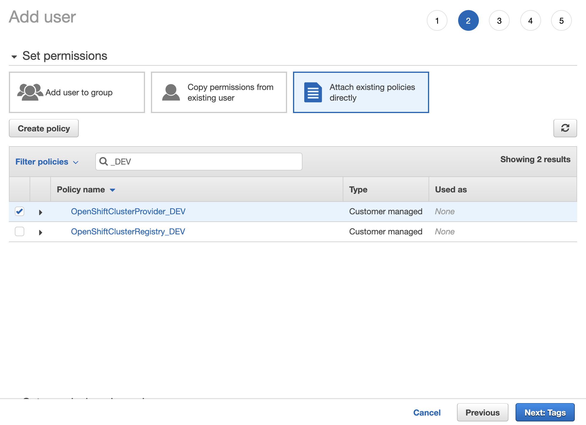
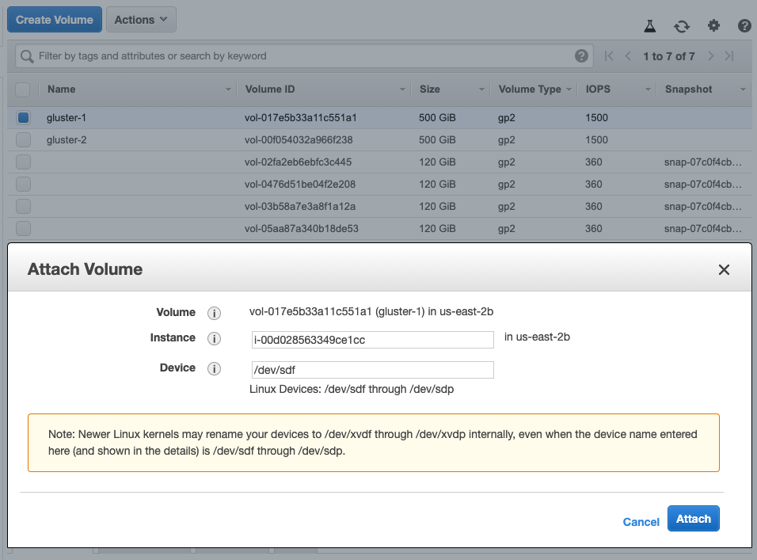

# Install Cloud Pak for Integration 2019.3.2 (CC47DEN) using OpenShift 3.11 on AWS

This document will walk through the setup up proccess of a **non-HA development** environment of Cloud Pak for Integration. This is **not** recommended for production setup.

For the purpose of this guide the AWS region used will be `us-east-2` and the availability zone will be `us-east-2b`. Make sure you are using the region that you prefer.

## Architecture


### Components

- 1 AWS Region
- 1 Availability Zone
- 3 Elastic IP addresses
  - 1 for the NAT VPC
  - 1 for the master node
  - 1 for the infra node
- 1 master node (master, etcd, boot node)
  - Instance Type: t2.2xlarge
    - Storage: 120 GiB
- 1 infra node
  - Instance Type: t2.2xlarge
  - Storage: 120 GiB
- 4 worker nodes
  - Instance Type: t2.2xlarge
  - Storage: 120 GiB
  - Allocation
    - 2 ICP nodes
    - 1 MQ node
    - 1 ACE node
- 3 EBS Volumnes for Gluster
  - 500 GiB
- 1 S3 Bucket for Registry

### VPC Network Details

- IPV4 CIDR Block: 10.0.0.0/16
  - Public Subnet: 10.0.0.0/24
    - Master Node
    - Infra Node
  - Private Subnet: 10.0.1.0/24
    - Worker Nodes

## AWS Resources Setup

### Route53

1. For the purpose of this instalation a Hosted Zone has been created in AWS Route 53 for the subdomain `ocp.mydomain.com` and includes the following records:
    - `ocp.mydomain.com` - Type: A - Value: Master Node Elastic IP (Instance will be set later)
    - `*.ocp.mydomain.com` - Type: A - Value: Infra Node Elastic IP (Instance will be set later)
    - `*.apps.ocp.mydomain.com` - Type: A - Value: Infra Node Elastic IP (Instance will be set later)

### AWS S3 Registry

1. On the AWS Console go to [S3](https://s3.console.aws.amazon.com/s3/home?region=us-east-2) and click **Create Bucket**

1. Add a unique name for the bucket, for this guide `openshift-cp4i-registry` and confirm that the region is the same as the one from your VPC.

1. Continue through the steps with the default options (including blocking public access).

    

### AWS Identity and Access Management (IAM)

> Note: To learn more go to [OpenShift 3.11 Configuring AWS](https://docs.openshift.com/container-platform/3.11/install_config/configuring_aws.html)

For the cluster to interact properly with the AWS infrastructure a policy and user must be created

1. On the AWS Console go to [IAM Policies](https://console.aws.amazon.com/iam/home?region=us-east-2#/policies) and click **Create Policy**

1. Select the tab `JSON` and add the following configuration and proceed to **Review Policy**

    ```json
    {
        "Version": "2012-10-17",
        "Statement": [
            {
                "Sid": "VisualEditor0",
                "Effect": "Allow",
                "Action": [
                    "ec2:AttachVolume",
                    "ec2:AuthorizeSecurityGroupIngress",
                    "ec2:CreateSecurityGroup",
                    "ec2:CreateTags",
                    "ec2:CreateVolume",
                    "ec2:DeleteVolume",
                    "ec2:DescribeInstances",
                    "ec2:DescribeRouteTables",
                    "ec2:DescribeSecurityGroups",
                    "ec2:DescribeVolume*",
                    "ec2:DescribeSubnets",
                    "ec2:DetachVolume",
                    "ec2:RevokeSecurityGroupIngress",
                    "elasticloadbalancing:CreateListener",
                    "elasticloadbalancing:CreateLoadBalancer",
                    "elasticloadbalancing:CreateLoadBalancerListeners",
                    "elasticloadbalancing:ConfigureHealthCheck",
                    "elasticloadbalancing:DeleteLoadBalancer",
                    "elasticloadbalancing:DeleteLoadBalancerListeners",
                    "elasticloadbalancing:DeleteListener",
                    "elasticloadbalancing:DescribeLoadBalancerAttributes",
                    "elasticloadbalancing:DescribeLoadBalancers",
                    "elasticloadbalancing:DescribeTags",
                    "elasticloadbalancing:ModifyLoadBalancerAttributes",
                    "elasticloadbalancing:RegisterTargets",
                    "elasticloadbalancing:RegisterInstancesWithLoadBalancer"
                ],
                "Resource": "*"
            }
        ]
    }
    ```

1. Add the name `OpenShiftClusterProvider_DEV` to the Policy and an optional description. The policy should like the following image. Click **Create Policy**

    

1. Create a second policy to allow OpenShift management of the S3 bucket defined to be used as registry. Click **Create Policy** and add the following `JSON` replacing `S3_BUCKET_NAME` with the name of the bucket created above.

    ```json
    {
        "Version": "2012-10-17",
        "Statement": [
        {
            "Effect": "Allow",
            "Action": [
            "s3:ListBucket",
            "s3:GetBucketLocation",
            "s3:ListBucketMultipartUploads"
            ],
            "Resource": "arn:aws:s3:::S3_BUCKET_NAME"
        },
        {
            "Effect": "Allow",
            "Action": [
            "s3:PutObject",
            "s3:GetObject",
            "s3:DeleteObject",
            "s3:ListMultipartUploadParts",
            "s3:AbortMultipartUpload"
            ],
            "Resource": "arn:aws:s3:::S3_BUCKET_NAME/*"
        }
        ]
    }
    ```

1. Add the name `OpenShiftClusterRegistry_DEV` to the Policy and an optional description. The policy should like the following image. Click **Create Policy**

    

1. On the AWS Console go to [IAM Users](https://console.aws.amazon.com/iam/home?region=us-east-2#/users) and click **Add user**

1. Set the username `openshift-provider` and select `Programmatic access` for Access type. Then click **Next: Permissions**

    

1. Select **Attach exiting policies directly** and look for `OpenShiftClusterProvider_DEV`

    

1. Proceed to the last step and make sure to take note of the `Access Key ID` and `Secret Access Key`

    

1. Create a second user to attach the registry policy created. Set the username `openshift-registry` with `Programmatic access` for Access type and attach the policy `OpenShiftClusterRegistry_DEV`. The user should look like the following:

    

1. Proceed to create the user and take not of the `Access key ID` and `Secret access key`. We will use both access keys in the invetory file when installing OpenShift.

### AWS Certificate Manager (ACM)

> Notes:
>
> AWS does not allow public certificates to be downloaded. Since this is needed to install OpenShift this guide imports a certificate into ACM instead of requesting one.
>
> The creation process of the certificate is out of scope of this document.

1. This instalation uses a [Let's Encrypt](https://letsencrypt.org/) certificate generated for the following domains:
    - Certificate Name = `ocp.mydomain.com`
    - Domains: `ocp.mydomain.com, *.ocp.mydomain.com. *.apps.ocp.mydomain.com`

1. On the AWS Console go to [Certificate Manager ACM](https://us-east-2.console.aws.amazon.com/acm/home?region=us-east-2#/) and click **Import a certificate**

1. Paste the PEM-encoded certificate body, private key, and certificate chain and click **Review and Import**

1. Validate that the domains correspond to what you are planning to use for this setup and click **Import**

    

### Elastic IPs

1. Allocate a total of 3 Elastic IP address for this setup to be used. Go to [Elastic IP Dashboard](https://us-east-2.console.aws.amazon.com/ec2/v2/home?#Addresses), click **Allocate new address** and follow the steps to generate the necessary Elastic IPs.

### VPC

1. On the AWS Console go to [VPC Dashboard](https://us-east-2.console.aws.amazon.com/vpc/home?region=us-east-2#dashboard:) and click **Launch VPC Wizard**

1. Create a new VPC with a private and public subnet.

    

1. Adjust the settings to what the picture below shows. Validate the CIDR block, availability zones for both public and private subnets and assign an elastic IP to the NAT gateway. Make sure the VPC has DNS hostnames as `yes`. Once the VPC create button is clicked it will take a few minutes to launch.

    

### EC2 Instances and GlusterFS EBS volumes

#### Master and Infra Nodes

1. On the AWS Console go to [EC2 Instances](https://us-east-2.console.aws.amazon.com/ec2/v2/home?region=us-east-2#Instances:sort=instanceId) and click **Launch Instance**

1. Select `Community AMIs` on the right and search for `RHEL 7.6 GA x86_64`. Make sure you select the latest `GA` image with `64-bit (x86)` architecture

    

1. Instance Type - Select `t2.2xlarge` will be used for this guide. Proceed to the next step.

1. Configure Instance Details - Update the number of instances to `2`. Make sure you are using the VPC `Public Subnet` with `Auto-assign Public IP` disabled (we will add an Elastic IP to each instance afterwards).

    

1. Storage - Increase the size of the default value to `120` GiB

    

1. Go to `Review and Launch` and verify the settings of node node. If everything looks correct click **Launch**

1. If you already have a key pair to access EC2 instances that can be used. If not create one. Once downloaded make sure the permissions for the key file are set to `400`

    `$ chmod 400 openshift.pem`

1. Once the instances are ready validate that you can ssh into each using the key pair using either the public DNS name or the Elastic IP assigned to it.

    `$ ssh -i "openshift.pem" ec2-user@ec2-13-59-205-8.us-east-2.compute.amazonaws.com`
    `$ ssh -i "openshift.pem" ec2-user@13.59.205.8`

1. Go back to [EC2 Instances](https://us-east-2.console.aws.amazon.com/ec2/v2/home?region=us-east-2#Instances:sort=instanceId) and update the name tag for each instance to identify the master and the infra nodes.

1. Go back to [Elastic IP Address](https://us-east-2.console.aws.amazon.com/vpc/home?region=us-east-2#Addresses:sort=allocationId) and assign the remaining Elastic IP addresses to the instances that were just created.

    

1. The instances once named and with the assigned Elastic IPs should look like the following

    

1. Go back to [Route 53](https://console.aws.amazon.com/route53/home?region=us-east-2#hosted-zones:) and update the record for the domain `ocp.mydomain.com` to use the master node's Elastic IP and  `*.ocp.mydomain.com` and `*.apps.ocp.mydomain.com` to the Elastic IP of the infra node.

    

1. AWS should automatically create a Security Group for this instance that starts with `launch-wizard`. Go to the [Security Group](https://us-east-2.console.aws.amazon.com/ec2/v2/home?region=us-east-2#SecurityGroups:sort=tag:Name) and make sure the following rules are in place for inbound traffic.

    

1. You can verify that the DNS is resolving correctly by connecting via SSH using the domain.

    `$ ssh -i "openshift.pem" ec2-user@ocp.mydomain.com`
    `$ ssh -i "openshift.pem" ec2-user@console.ocp.mydomain.com`

#### Worker Nodes

1. On the AWS Console go to [EC2 Instances](https://us-east-2.console.aws.amazon.com/ec2/v2/home?region=us-east-2#Instances:sort=instanceId) and click **Launch Instance**

1. Select `Community AMIs` on the right and search for `RHEL 7.6 GA x86_64`. Make sure you select the latest `GA` image with `64-bit (x86)` architecture

    

1. Instance Type - Select `t2.2xlarge` will be used.

1. Configure Instance - Update the `Number of instances` field to `4`

1. Configure Instance - Make sure you are using the VPC previously created and the `Private Subnet` with `Auto-assign Public IP` disabled.

    

1. Storage - Increase the size of the default value to `120` GiB

1. Go to Review and Launch and verify the settings of node node. If everything looks correct click **Launch** - It will take a few minutes for the instances to setup.

1. Label your instances accordingly. It should look something like this:

    

1. AWS should automatically create a another Security Group for this instance that starts with `launch-wizard`. Go to the [Security Group](https://us-east-2.console.aws.amazon.com/ec2/v2/home?region=us-east-2#SecurityGroups:sort=tag:Name) and make sure the following rules are in place for inbound traffic.

    

#### GlusterFS Volumes

> Note: There must be at least 3 EBS volumes available for GlusterFS to be used

1. On the AWS Console go to [EBS Volumes](https://us-east-2.console.aws.amazon.com/ec2/v2/home?region=us-east-2#Volumes:sort=desc:createTime) and click **Create Volume**

1. Make sure the availability zone is the same as your instances. Increase the Size (GiB) of the volume to `500` and the availability zone is the same as the other resources created. Additionally add a name tag.

    

1. Create a 2nd and a 3rd volume with the same last 2 steps.

1. Label volumes as `gluster-1`, `gluster-2` and `gluster-3`

1. Attach each of the volumes to each of the worker nodes that have been labeled as `gluster` by selecting a volume then click on the dropdown `Actions` and select `Attach Volume`. Seach for the instance

    

#### Resources Tags

From the [Configuring AWS on OpenShift](https://docs.openshift.com/container-platform/3.11/install_config/configuring_aws.html#configuring-the-openshift-container-platform-cloud-provider-at-installation)

> Every master host, node host, and subnet must have the kubernetes.io/cluster/\<CLUSTER_ID\>,Value=(owned|shared) tag.
> One security group, preferably the one linked to the nodes, must have the kubernetes.io/cluster/\<CLUSTER_ID\>,Value=(owned|shared) tag.

1. For the purpose of this guide we will use `openshift` as the unique cluster name. Replace `CLUSTER_ID` with this value.

1. Select each of the [instances](https://us-east-2.console.aws.amazon.com/ec2/home?region=us-east-2#Instances:sort=tag:Name) created and add the tag key `kubernetes.io/cluster/openshift` and value `owned`. Additionally you can show the tag as a column to ensure everything is setup properly.

    

1. Select both the private and public [subnets](https://us-east-2.console.aws.amazon.com/vpc/home?region=us-east-2#subnets:sort=SubnetId) and add the same tag to them.

    

1. Go to add the same tag to the [security group](https://us-east-2.console.aws.amazon.com/ec2/home?region=us-east-2#SecurityGroups:sort=tag:Name) associated with worker nodes.

    

### SSH Session Keep-Alive (Optional)

To keep the session alive with EC2 instances during the install process add the following entries to the file `~/.ssh/config` in your local machine

```bash
ServerAliveInterval 60
ServerAliveCountMax 5
```

## Set up Password-less SSH Access

The master node needs to have root access via password-less SSH to each of the nodes.

1. Copy the pem key from your local machine to the master node

    `$ scp -i "openshift.pem" ~/openshift.pem ec2-user@ocp.mydomain.com:~/.`

1. SSH into the master node

    `$ ssh -i "openshift.pem" ec2-user@ocp.mydomain.com`

1. As root, generate a new ssh key that will be added to each of the worker nodes to allow access from the master node

    ```bash
    [ec2-user]$ sudo -s
    [root]$ ssh-keygen
    Generating public/private rsa key pair.
    Enter file in which to save the key (/root/.ssh/id_rsa):
    Enter passphrase (empty for no passphrase):
    Enter same passphrase again:
    Your identification has been saved in /root/.ssh/id_rsa.
    Your public key has been saved in /root/.ssh/id_rsa.pub.
    The key fingerprint is:
    SHA256:pJeyrwTqmuPEKS/pfsEKX5y0A/fbOQG/6/0mt+ZlCQU root@ip-10-0-0-78.us-east-2.compute.internal
    The key's randomart image is:
    +---[RSA 2048]----+
    |            E    |
    |             .   |
    |        .     .  |
    |  . o .o .   .   |
    |  .=.+ooS   .    |
    |o .+*..+o    . . |
    |o*o...oo +    +  |
    |*=.. ...=.. +o   |
    |*B+   .o+o.B+.   |
    +----[SHA256]-----+
    ```

1. Load the public key in the clipboard

    ```bash
    [root]$ cat ~/.ssh/id_rsa.pub
    ssh-rsa AAAAB3NzaC1yc2EAAAADAQABAAABAQCsNBHtmUAuZdlTUa9efGKhlMiWmpsdKUYWf/gdeAhHDqYp2S7J3GQFXMu8WBrvkuqdmYBzrjkLe8SpVgiITEVp2DDWxq909uvKKTTqAUy6nrrnmGymclfLjlrKCRShkVFVfsg621pqWTNFsL7j6r1EH8Js7TJ/CC7klO5Dj8DGID0+w+sXm/OBpS7WbvtXwgMFjrnvVEARsyI38WNuL+JZkYtWNjgkrZPWMbJiLmkOihfHMSUsuSmjR8Kum3aiooJkDm7udPoywh/J93KdEeRdMUNGzoPUFdh3L17VOY8/lzwuaccGGJUcWfD5khu/pVpexy3Txg6D4NXg4sna6X+J root@ip-10-0-0-78.us-east-2.compute.internal
    ```

1. Using the key from your local machine ssh from the master node into each of the worker nodes, become root user and add the public key to the `.ssh/authorized_keys` file

    ```bash
    [root@ip ec2-user]$ ssh -i "openshift.pem" ec2-user@ip-10-0-1-130.us-east-2.compute.internal

    [ec2-user@ip ~]$ sudo -s

    [root@ip ec2-user]$ echo 'ssh-rsa AAAAB3NzaC1yc2EAAAADAQABAAABAQCsNBHtmUAuZdlTUa9efGKhlMiWmpsdKUYWf/gdeAhHDqYp2S7J3GQFXMu8WBrvkuqdmYBzrjkLe8SpVgiITEVp2DDWxq909uvKKTTqAUy6nrrnmGymclfLjlrKCRShkVFVfsg621pqWTNFsL7j6r1EH8Js7TJ/CC7klO5Dj8DGID0+w+sXm/OBpS7WbvtXwgMFjrnvVEARsyI38WNuL+JZkYtWNjgkrZPWMbJiLmkOihfHMSUsuSmjR8Kum3aiooJkDm7udPoywh/J93KdEeRdMUNGzoPUFdh3L17VOY8/lzwuaccGGJUcWfD5khu/pVpexy3Txg6D4NXg4sna6X+J root@ip-10-0-0-78.us-east-2.compute.internal' >> ~/.ssh/authorized_keys

    [root@ip ec2-user]$ cat ~/.ssh/authorized_keys
    no-port-forwarding,no-agent-forwarding,no-X11-forwarding,command="echo 'Please login as the user \"ec2-user\" rather than the user \"root\".';echo;sleep 10" ssh-rsa AAAAB3NzaC1yc2EAAAADAQABAAABAQCj3A3UZd1dudpIiSD4W+5RgQpT1rPOfPGnK9MnYrOtixR8DoPfcJ8sB9SxBH7MZSlS4BrUi0vMDj0x9suBU0X/ooOpvrYvF/4RTF7F1/3ErWuWUkYdqBAIrRac/8IlOQ7yTT+hdf4cQ/WctvFPd+Kx97hVjaZXBMeIGReUcq9g6WZU/cp3q0BrnvOK3YjLbnOkg4Eg6+a3ul856DZjjdOQOBn6aROO+cyNwooF957RbOhiLKBi+EUfxZtUyDqIA/QnIdvIlnuEh1JSLo/LLosdaGreAgs4Op9jFEuD5Sv9E5YN68Ao8zxdJMJs1LggpFmOGG8Cr3oymFiZ6dNF9uMB openshift
    ssh-rsa AAAAB3NzaC1yc2EAAAADAQABAAABAQCsNBHtmUAuZdlTUa9efGKhlMiWmpsdKUYWf/gdeAhHDqYp2S7J3GQFXMu8WBrvkuqdmYBzrjkLe8SpVgiITEVp2DDWxq909uvKKTTqAUy6nrrnmGymclfLjlrKCRShkVFVfsg621pqWTNFsL7j6r1EH8Js7TJ/CC7klO5Dj8DGID0+w+sXm/OBpS7WbvtXwgMFjrnvVEARsyI38WNuL+JZkYtWNjgkrZPWMbJiLmkOihfHMSUsuSmjR8Kum3aiooJkDm7udPoywh/J93KdEeRdMUNGzoPUFdh3L17VOY8/lzwuaccGGJUcWfD5khu/pVpexy3Txg6D4NXg4sna6X+J root@ip-10-0-0-78.us-east-2.compute.internal
    ```

1. Verify that the master node has password-less SSH root access to each of the nodes.

## RedHat Registration and Repositories Setup

On all the nodes perform the following steps to register them:

1. Register with RedHat

    `$ subscription-manager register --username='REDHAT_USERNAME' --password='REDHAT_PASSWORD' --force`

1. Get the latest subscription data from RedHat Subscription Manager (RHSM):

    `$ subscription-manager refresh`

1. List all available subscriptions

    `$ subscription-manager list --available`

1. Find the pool ID that provides OpenShift Container Platform subscription and attach it. `<POOL_ID>` refers to an alphanumeric string.

    `$ subscription-manager attach --pool=<POOL_ID>`

1. Set up the repositories needed for OpenShift using the command:

    ```bash
    subscription-manager repos --enable="rhel-7-server-rpms" \
        --enable="rhel-7-server-extras-rpms" \
        --enable="rhel-7-server-ose-3.11-rpms" \
        --enable="rhel-7-server-ansible-2.6-rpms"
    ```

> Note: While building this guide the AMI available in this region had an old kernel version. The required kernel version is `3.10.0-1062` or greater

1. If needed, update the node with the latest packages and reboot to load the updated kernel:

    ```bash
    yum -y update
    reboot
    ```

1. On each node, set vm.max_map_count to 1048575. This is minimum required value if you want to install API Connect, else minimum required value is 262144

    `sudo sysctl -w vm.max_map_count=1048575`

    To review that the value was applied use the command:

    `sudo sysctl -a | grep vm.max_map_count`

## OpenShift Installation

### Packages

1. The installer for OpenShift is provided by the `openshift-ansible` package. Install it using `yum` on the **master** node

    ```bash
    yum -y install wget git net-tools bind-utils iptables-services bridge-utils bash-completion kexec-tools sos psacct
    yum -y update
    reboot

    yum -y install openshift-ansible
    yum -y install docker
    ```

1. Copy the certificates generated above into a known location

    ```bash
    [root@ip ec2-user]$ ls /opt/certs/
    chain.pem  fullchain.pem  privkey.pem
    ```

### Inventory File

The inventory file is the baseline of the setup that Ansible will run. There are many different combinations. This file loation by default is `/etc/ansible/hosts`

If a different location is desired then whenever running `ansible-openshift` commands a flag must be included `-i <path/to/inventory>`

Sample inventory file that matches the AWS setup done above:

>Make sure you update the values of this file before starting the installation.

[Sample hosts file](./resources/sample_hosts.ini)

### Run the Installation Playbooks

1. The installation constists in a 2 step process and each triggered by an ansible playbook.

1. Go to the ansbile folder

    `$ cd /usr/share/ansible/openshift-ansible`

1. Run the Prerequisites playbook

    `$ ansible-playbook playbooks/prerequisites.yml`

1. Run the Deploy-Cluster playbook

    `$ ansible-playbook playbooks/deploy_cluster.yml`

### Validate OpenShift Installation

1. From the master host login with the system admin user

    `$ oc login -u system:admin`

1. List all the nodes in your cluster to confirm all of them are working

    `$ oc get nodes`

1. Add the rol `cluster-admin` to the user `admin` to access the cluster console.

    `$ oc adm policy add-cluster-role-to-user cluster-admin admin`

1. Open the Web Console and login with the `admin` user

    `https://ocp.mydomain.com:8443`

1. Open the Cluster Console and login with the `admin` user

    `https://console.ocp.mydomain.com`

### Troubleshoot

#### 1. "Unable to start service atomic-openshift-node" error

- The error message may look something like this

    ```bash
    TASK [openshift_control_plane : Start and enable self-hosting node] ***********************************************************************************************************************************************
    Friday 08 November 2019  04:29:32 +0000 (0:00:00.179)       0:21:38.618 *******
    fatal: [ip-10-0-0-78.us-east-2.compute.internal]: FAILED! => {"changed": false, "msg": "Unable to start service atomic-openshift-node: Job for atomic-openshift-node.service failed because the control process exited with error code. See \"systemctl status atomic-openshift-node.service\" and \"journalctl -xe\" for details.\n"}
    ```

- To get the detailed error run the command `$ journalctl -xe`

    ```bash
    Building AWS cloudprovider
    Tag "KubernetesCluster" nor "kubernetes.io/cluster/..." not found; Kubernetes may behave unexpectedly.
    failed to run Kubelet: could not init cloud provider "aws": AWS cloud failed to find ClusterID
    ```

- **Solution:** Ensure that the AWS resources have the correct ClusterID tag

#### 2. "Unable to find pods" error

- The error message may look something like this

    ```bash
    TASK [openshift_storage_glusterfs : Check for GlusterFS cluster health] ****************************************************************************************************************************************
    Tuesday 19 November 2019  21:57:42 +0000 (0:00:00.116)       0:19:33.558 ******
    FAILED - RETRYING: Check for GlusterFS cluster health (3 retries left).
    FAILED - RETRYING: Check for GlusterFS cluster health (2 retries left).
    FAILED - RETRYING: Check for GlusterFS cluster health (1 retries left).
    fatal: [ip-10-0-0-65.us-east-2.compute.internal -> ip-10-0-0-65.us-east-2.compute.internal]: FAILED! => {"attempts": 3, "changed": false, "msg": "Unable to find pods: ", "state": "unknown"}
    ```

- **Solution:** This seems to be an issue with the latest release. It's documented [here](https://github.com/openshift/openshift-ansible/issues/12002) the current workaround is documented [here](https://github.com/openshift/openshift-ansible/issues/12002#issuecomment-553589788)

## Cloud Pak for Integration Installation

### Download

1. The Cloud Pak for Integration installer should be downloaded from Passport Advantage prior to installation, as a `tar` bundle.  The product name is `Cloud Pak for Integration 2019.3.2` with part number `CC47DEN` and the corresponding filename is `ibm-cp-integration-2019.3.2-ocp.tar.gz`.

### Prerequisites

> Note: If you are using a boot node you will need to add port forwarding in a separate session and keep it open and then log into docker.
>
> _In this guide the master node is also the boot node and this is **not** required._

```bash
# Start port forwarding
kubectl -n default port-forward svc/docker-registry 5000:5000
# Authenticate with docker
docker login -u $(oc whoami) -p $(oc whoami -t) docker-registry.default.svc:5000`
```

1. Unpack the installation file

    `$ tar xf ibm-cp-integration-2019.3.2-ocp.tar.gz`

1. Load the container images into local docker _(This may take up to 30 minutes)_

    `$ tar xf installer_files/cluster/images/ibm-cloud-private-rhos-3.2.0.1907.tar.gz -O | sudo docker load`

1. Change the directory to `cluster`

    `$ cd <DOWNLOAD_DIRECTORY>/installer_files/cluster`

1. Copy the kubeconfig to the cluster directory by either

    `$ oc config view > kubeconfig` or `$ cp /etc/origin/master/admin.kubeconfig kubeconfig`

1. For IBM Cloud Private with OpenShift clusters, if you want to deploy IBM Cloud Private on any OpenShift master or infrastructure node, you must label the node as compute. For example:

    > _In this guide there are dedicated hosts for ICP and this is **not** required_.

    `$ oc label node <master node host name/infrastructure node host name> node-role.kubernetes.io/compute=true`

1. If using GlusterFS for storage, make sure it is set as the default storage class

    ```bash
    $ oc get sc
    AME                      PROVISIONER                            AGE
    glusterfs-storage         kubernetes.io/glusterfs                1m
    glusterfs-storage-block   gluster.org/glusterblock-app-storage   1m
    gp2 (default)             kubernetes.io/aws-ebs                  18h
    $ oc patch sc glusterfs-storage \
    -p '{"metadata": {"annotations":{"storageclass.kubernetes.io/is-default-class":"true"}}}'
    Patch applied
    ```

### config.yml File

The `config.yaml` file is the baseline of the setup. There are many different combinations. This file loation by default is `<DOWNLOAD_DIRECTORY>/installer_files/cluster`

Sample config file that matches the AWS setup done above:

> Make sure you update the values of this file before starting the installation.

[Sample config.yaml](./resources/sample_config.yaml)

### Run the Installation

The install process will take several minutes to complete

```bash
sudo docker run -t --net=host -e LICENSE=accept -v $(pwd):/installer/cluster:z -v /var/run:/var/run:z \
--security-opt label:disable ibmcom/icp-inception-amd64:3.2.0.1907-rhel-ee \
install-with-openshift -vvv | tee install.log
```

> `install.log` will contain the installation logs in case you need to troubleshoot an issue.

### Validate CP4I Installation

1. Open the Cluster Console and login with the `admin` user

    `https://icp-console.apps.ocp.mydomain.com`
