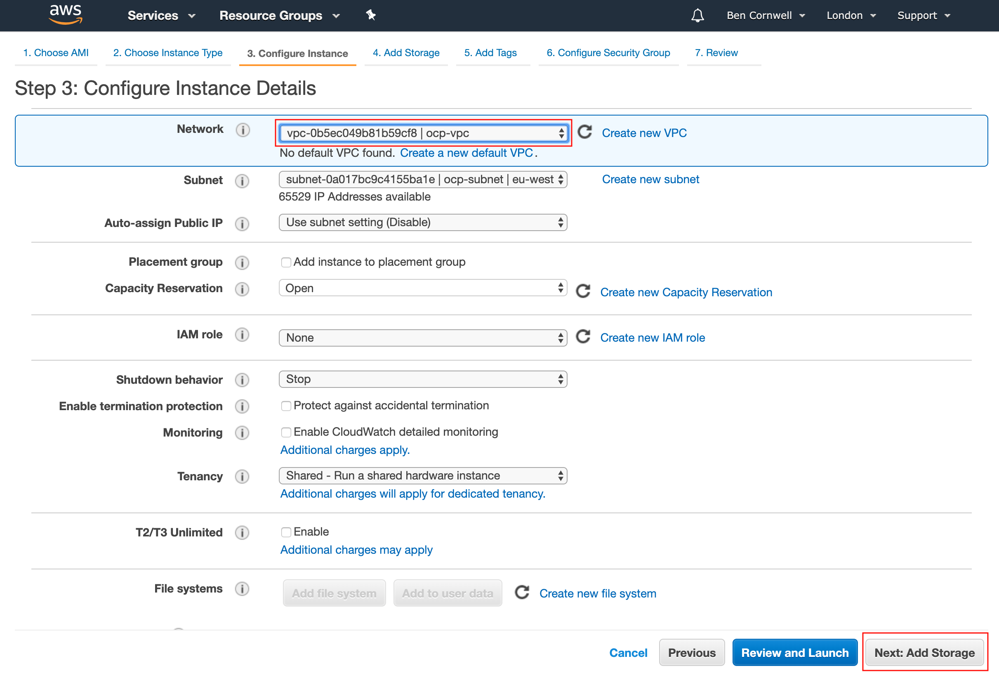

Ben Cornwell, IBM

31/10/2019

Introduction
============

IBM's Cloud Pak for Integration is a Kubernetes-based platform for
installing and managing the suite of integration products. CP4I 3.20
requires RedHat Openshift Container Platform (RHOCP) 3.11.

This installation document shows how to create an AWS stack manually,
install RHOCP, and then CP4I. CP4I includes Cloud Pak Foundation, which
is the elements of IBM Cloud Private (ICP) that are required to run
CP4I. In terms of dependency, the stack is as follows:

  - Cloud Pak for Integration
  - IBM Cloud Private
  - Openshift
  - Kubernetes

However in practice Openshift, ICP and CP4I are all installed as
Kubernetes artefacts. These instructions run the Openshift installer
first, which creates a Kubernetes cluster; then the CP4I installer which
installs both ICP and CP4I.

This document is step-by-step, but if any customisation is required,
please refer to the installation instructions for Openshift and CP4I:

<https://docs.openshift.com/container-platform/3.11/install/running_install.html>

<https://www.ibm.com/support/knowledgecenter/en/SSGT7J_19.3/install/install_rhos.html>

Target Architecture
===================

These instructions will create a minimally highly available cluster,
with one OCP master node, one ICP master node and three worker nodes.
Here, we use the term 'master node' to mean one supporting workloads
required for the cluster itself (the control plane) rather than
user-space workloads i.e. your applications. Nodes are allocated roles
at installation time. Openshift and ICP node roles are slightly
different.

In this cluster, there is one Openshift master node, and one node
hosting the ICP master, management and proxy components (this node is
actually a worker). This is not a fully HA configuration, however there
is some resilience as far as the workloads are concerned because there
are three workers. The worker nodes are also assigned the glusterfs role
for persistent storage.

Preparation
===========

These instructions do not use a separate boot node for installation.
Everything can be done from the OCP master. Openshift will be downloaded
automatically during the installation via rpm, however the CP4I
installer should be downloaded from Passport Advantage prior to
installation, as a tar bundle. The product is Cloud Pak for Integration
2019.3.2, the part number is CC47DEN and the filename is
ibm-cp-integration-2019.3.2.2-ocp.tar.gz. It's 23Gb in size, so it's
best to download it directly onto the master node on which you intend to
work, after it's created in section 4.

Creating AWS Components
=======================

Considerations
--------------

### Sizing

The cluster sizing depends on what CP4I products you intend to install
-- see
<https://www.ibm.com/support/knowledgecenter/en/SSGT7J_19.3/install/sysreqs.html>
for more information. Please note that the sizings listed refer to the
worker nodes. Sizing of the master/infrastructure nodes depends on
traffic and workload. For the sake of this document we will choose a
modest configuration that will get the system working.

### Storage

As a general purpose cluster, storage is included in these instructions.
GlusterFS is used here, but beware that APIC does not work with
GlusterFS so if APIC is required another storage type must be used for
APIC.

### OS Level

This stack will not run on RHEL 8. It has been tested on RHEL 7.6,
earlier versions may work.

Log in and select region
------------------------

On logging into AWS you will see the AWS management console. You should
select an appropriate region for your cluster using the drop-down in the
top right. Choose one that is geographically close, as network access
will be quicker.


Create a VPC (Virtual Private Cloud)
------------------------------------

1.  The cluster requires some infrastructure before the instances can be
    created. From the AWS console main page, click on 'Services' and
    scroll down to VPC.


2.  Select Your VPCs from the left. Click on 'Create VPC'


3.  Enter a name and CIDR such as 172.31.0.0/16. Click 'Create'


4.  Right-click on the new VPC and select 'Edit DNS hostnames'


5.  Enable DNS hostnames, then click 'Save', then 'Close'


6.  Now click on NAT Gateways


7.  Click on 'Create NAT Gateway'


8.  Click on 'Subnets' then 'Create Subnet'


9.  Supply a name for your subnet and select your VPC from the
    drop-down. For simplicity, for the CIDR block, you can enter the
    same CIDR as your subnet -- this means that the subnet covers the
    entire VPC. Click 'Create'.


10. Click on 'Internet Gateways' on the left then 'Create internet
    gateway'


11. Enter a name, then click 'Create'


12. On the next page, right-click on the new internet gateway and select
    'Attach to VPC'


13. Choose your VPC from the list and click 'Attach'


14. Click 'NAT Gateways' on the left then 'Create NAT Gateway'.


15. On the next screen, select your subnet from the drop-down, then
    'Create new EIP', then 'Create a NAT Gateway'. Click close on the
    next screen.


16. Click 'Route Tables' on the left and then select your route table.
    Click on 'Edit Routes'


17. Add a route to the internet from your cluster, for convenience.
    Click 'Add Route' then enter 0.0.0.0/0 in the destination field and
    choose your internet gateway from the drop-down. Click 'Save Routes'


Creating Instances
------------------

1.  Access the AWS console and from the Services drop-down at the top of
    the page, select EC2.


2.  Click on 'Launch Instance'


The default RHEL image is 8.0, but we need an earlier version. Click on
'Community AMIs' then in the search box, type RHEL 7.6 and search. The
first in the list should be
**RHEL-7.6_HVM_GA-20190128-x86_64-0-Hourly2-GP2** - click on
'select'.


3.  Select 'General Purpose' t2.2xlarge and then click 'Configure
    Instance Details' to proceed.


4.  On the next page (Configure Instance Details) set the number of
    instances to be 5. We are not creating auto scaling groups in this
    document so ignore the message. Select your VPC in the 'Network'
    drop-down. Change 'Auto-assign Public IP' to 'Enable'. Click 'Next:
    Add Storage'.

> 
>

5.  Increase the root volume size to 300GiB. This is enough for the
    cluster to work with. We are going to use GlusterFS for application
    storage and it requires raw block storage devices. However, we only
    want to create the storage devices for the worker nodes, so we will
    add them later. After changing the volume size on the root volume,
    click on 'Review and Launch'.

6.  


7.  On the next page you will be warned that you are not eligible for
    the free tier. If you get a warning about your instance being 'open
    to the world', because the security group by default allows SSH from
    any address. This can be changed later to whitelist addresses from
    your corporate network if desired. Review the settings then click
    Launch.

8.  AWS instances are only accessible with SSH by private key. If you
    already have a private key you can select it here, otherwise select
    'Create a new key pair' from the drop-down, type in a name and click
    'Download Key Pair'. You cannot proceed without selecting or
    creating a key pair and downloading it. Click 'Launch Instance' to
    proceed. Don't forget to do chmod 600 on your key file. If you have
    selected an existing key, you must click the disclaimer to
    acknowledge you have access to the key before you can proceed.

    


9.  The instances will create and start, this takes a few minutes. When
    they are all running, label them: master1-ocp, master2-icp and
    worker1-3 by clicking on the pencil symbol in the name column. The
    name is only for your benefit, it does not affect the network
    naming.

    


10. Since the worker nodes will be GlusterFS nodes, they need an extra
    block storage device. They need to be created independently and
    assigned to the nodes. Click on 'Volumes' on the left side menu. The
    existing volumes attached to each instance are already there. Click
    on 'Create Volume'

> 
>

11. On the next page, accept the defaults for everything except the
    volume size and 'Availability Zone'. Choose 500GiB for the size.
    Click 'Create Volume'. **Make sure the availability zone matches
    that of your instances.** Repeat three times.


12. Label each volume gluster1-3


13. For each of the gluster volumes, right click and select 'attach
    volume'.


14. In the next screen you can type the name you gave to the instance in
    step 10 e.g. worker1, then click on the instance ID that is
    displayed. In the 'device' field the default is /dev/sdf which can
    be left as it is. You will see a message saying that the device may
    be renamed -- it will be. So /dev/sdf typed into the box will become
    /dev/xvdf when attached to the instance. Make a note of the xvd*
    device name for later. Click 'Attach'

> 
>

15. Now you can verify connection to the instances. On the left select
    'Instances' to get the instance list, and then right click on one of
    the instances and click 'connect'. The resulting dialog gives
    instructions to connect to the instance. In this case, ssh is
    preferred.

> 
>

16. Set up firewall rules. On the 'Instances' page, click on one of the
    nodes and check the 'Description' tab at the bottom. Under 'Security
    Groups' one should be listed as a hyperlink. It should be called
    something like 'launch-wizard-1' as it is automatically created by
    the launch wizard. Click on the link.

    


17. Make a note of the Group ID for the security group. Click on the
    'Inbound' tab at the bottom then 'Edit'.

    


18. You should see one rule allowing SSH access. You will need three
    more. Click on Edit

    

    then 'Add rule' then select the parameters to make the list look
    like the below image. The rule here labelled 'Internal access' is to
    allow all traffic, BOTH UDP and TCP between all nodes in this
    security group. When adding, start typing the security group ID in
    the 'source' box and it should auto-complete. The other rules are to
    allow external access to the cluster API, the web console and the
    router (and hence the applications hosted on the cluster) -- in this
    example we have allowed access from anywhere, but you can control
    access from your own network using a CIDR. The outbound rule should
    already be set to allow everything.

    


19. Set up DNS resolution from your local machine. This required because
    Openshift and ICP route traffic to services by matching the hostname
    of the request to that specified in the service. The services by
    default are bound to the FQDN of the router node (the master in this
    case as specified in the ocp-inventory file under
    openshift_master_cluster_public_hostname) with a prefix to
    identify the service.

    This can be done with a local DNS server, using a wildcard DNS
    record; a service such as dnsmasq, or simply by editing the hosts
    file on the local machine (/etc/hosts on Linux and Mac;
    c:windowssystem32driversetchosts on Windows). Add the
    following lines:

```
# AWS Cluster
<master1 ocp ip> <master1 ocp external hostname>
<master1 ocp ip> console.apps.<master1 ocp external hostname>
<master1 ocp ip> icp-proxy.apps.<master1 ocp external hostname>
<master1 ocp ip> icp-console.apps.<master1 ocp external hostname>
<master1 ocp ip> docker-registry-default.apps.<master1 ocp external hostname>
<master1 ocp ip> registry-console-default.apps. <master1 ocp external hostname>
<master1 ocp ip> heketi-storage-glusterfs.apps. <master1 ocp external hostname>
<master1 ocp ip> apiserver-kube-service-catalog.apps.<master1 ocp external hostname>
<master1 ocp ip> asb-1338-openshift-ansible-service-broker.apps.<master1 ocp external hostname>
<master1 ocp ip> alertmanager-main-openshift-monitoring.apps.<master1 ocp external hostname>
<master1 ocp ip> grafana-openshift-monitoring.apps.<master1 ocp external hostname>
<master1 ocp ip> prometheus-k8s-openshift-monitoring.apps.<master1 ocp external hostname>
```


Pre-Installation Configuration
==============================

Many of these commands need to be run on each host. The commands are
given individually. For the ones that do need to be run on every host
you may find it more efficient to create your own script to remotely
execute on each node using foreach.

PLEASE NOTE: Your AWS instance has two IP addresses and hence two
hostnames -- internal/private and external/public. ALWAYS use the
internal/private hostname unless specifying an address accessible from
outside the cluster.

Passwordless SSH
----------------

For the installer to work, ssh must be set up from the node on which you
are running the installation (which will be master1) to the other nodes,
as the root user (because we will be installing as root). The usual
process for this does not work, because we need to set up passwordless
ssh for root but our private key is only for ec2-user. We need to
manually log into each node from the master (including itself), run sudo
-s and install the private key.

Run the following command to make sure the key file has the correct
permissions
```
# chmod 600 <key file>
```
Copy the private key to master1 from your local machine (e.g. from
Linux/Mac, from Windows use PuTTY)
```
$ scp -i <key file> <key file> ec2-user@<master1 public
hostname>:
```
Connect to master1 then start a root shell (everything will be run as
root from now on)
```
$ ssh -i <key file> ec2-user@<master1 public hostname>
$ sudo -s
```
Create a key pair:
```
# ssh-keygen (press enter three times accepting defaults)
```
Then copy the resulting key (id_rsa.pub) to the ec2-user's homedir on
ALL the nodes, including the master1 you are currently running on (you
will be sshing to all the nodes from master1 including master1 itself!):
```
# scp -i /home/ec2-user/<AWS private key file> /root/.ssh/id_rsa.pub \
#   ec2-user@<node private hostname>:
```
Then, for each node, SSH in, elevate the shell and append the key to
root's authorized_hosts file:
```
# ssh -i home/ec2-user/<key file> ec2-user@<node private hostname>
# sudo -s
# touch /root/.ssh/authorized_keys
# cat ./id_rsa.pub >> /root/.ssh/authorized_keys
```
Now you should be able to test simple ssh (from your elevated shell on
master1) using the following, and gain access without a prompt:
```
# ssh <node private hostname>
```
Setting up the Red Hat Subscription
-----------------------------------

Each node needs to be registered with Red Hat using your credentials and
attached to the pool containing the OpenShift license. Your Red Hat
credentials can be found from the Redhat Customer Portal -- they are not
the same as the credentials you use to log into the site. The following
commands will register the server, and list all available subscriptions,
from where you should be able to see your Pool ID relating to Openshift.
```
# subscription-manager register --username=<username> \
#   --password=<password> --force
# subscription-manager list --available
```
Make a note of the relevant pool ID.

**Note:** If you need to delete your cluster, don't forget to
un-register your server first.

Preparing the Nodes
-------------------

The following commands need to be executed on ALL nodes. They can be
bundled together in a single script.

Update kernel - this installation requires a kernel version of
3.10.0-1062 or greater.
```
# yum update kernel
```
1.  Register system with Red Hat and attach to the required pool, and
    enable repositories

```
# subscription-manager register --username=<username> \
#   --password=<password> --force
# subscription-manager attach --pool=<pool ID>
# subscription-manager repos \
#   --enable="rhel-7-server-rpms" \
#   --enable="rhel-7-server-extras-rpms" \
#   --enable="rhel-7-server-ose-3.11-rpms" \
#   --enable="rhel-7-server-ansible-2.6-rpms";

```
2.  Update packages:

```
# yum -y -q update;
# yum -y -q install wget git net-tools bind-utils\
#   iptables-services \
#   bridge-utils bash-completion kexec-tools sos psacct;
# yum -y -q install openshift-ansible;
# yum -y -q install docker;
```
3.  Update OS parameters:

```
# sed -i 's/net.ipv4.ip_forward = 0/net.ipv4.ip_forward = \
#   1/g' /etc/sysctl.conf;
# sed -i 's/SELINUX=disabled/SELINUX=enforcing/g' \
#   /etc/selinux/config;
# service NetworkManager start;
# chkconfig NetworkManager on;
# sysctl -w vm.max_map_count=262144;
```

4.  Because the kernel has been updated, the nodes need to be restarted
    to allow the new kernel to be used. Reboot all the nodes using the
    AWS console or the reboot command.

Installing Openshift
====================

Setting up the Inventory File
-----------------------------

The installation of Openshift is configured via an inventory file. There
are many configuration options that can be set in the inventory file,
but here a template will be provided. Simply fill in the relevant
details for your cluster and save it somewhere on master1. Please read
the comments very carefully and make the appropriate changes.

```
#################### OpenShift 3.11

# Create an OSEv3 group that contains the masters, nodes, and etcd
groups

[OSEv3:children]
masters
nodes
etcd
glusterfs
glusterfs_registry

# Set variables common for all OSEv3 hosts
[OSEv3:vars]

# We are using root for the ssh user
ansible_ssh_user=root

openshift_deployment_type=openshift-enterprise
openshift_master_cluster_public_hostname=<master1 ocp public
hostname>
openshift_master_cluster_hostname=<master1 ocp private hostname>
openshift_master_default_subdomain=apps.<master1 ocp public
hostname>

# This cluster uses htpasswd authentication

openshift_master_identity_providers=[{'name': 'htpasswd_auth',
'login': 'true', 'challenge': 'true', 'kind':
'HTPasswdPasswordIdentityProvider'}]

# The installer adds users listed here to the htpasswd file. Obtain an
# encrypted password for user 'admin' with the command:
#
# htpasswd -n -b -B admin <password>
#
# This outputs the username and password separated by a colon -- the
# password is *everything* to the right of the colon e.g.
#
# htpasswd -n -b -B admin Passw0rd
#
# Produces
#
# admin:$2y$05$yjGFWse97laY16EeM45oweDhiR0/s8w57fxmO7EfdbyBzBsTs.RkC
#
# The password is then
#
# $2y$05$yjGFWse97laY16EeM45oweDhiR0/s8w57fxmO7EfdbyBzBsTs.RkC

openshift_master_htpasswd_users={'admin':'<encrypted_password>'}

openshift_hosted_registry_storage_kind=glusterfs
openshift_hosted_registry_storage_volume_size=100Gi
openshift_storage_glusterfs_storageclass_default=true
openshift_storage_glusterfs_image=registry.redhat.io/rhgs3/rhgs-server-rhel7:v3.11
openshift_storage_glusterfs_block_image=registry.redhat.io/rhgs3/rhgs-gluster-block-prov-rhel7:v3.11
openshift_storage_glusterfs_heketi_image=registry.redhat.io/rhgs3/rhgs-volmanager-rhel7:v3.11

# These credentials are the ones you used to register the servers with
Red Hat
oreg_auth_user=<Red Hat username>
oreg_auth_password=<Red Hat password>

# host group for masters
[masters]
<master 1 ocp private hostname>

# host group for etcd
[etcd]
<master 1 ocp private hostname>

# host group for nodes, includes region info
[nodes]
<master1 ocp private hostname> openshift_node_group_name='node-config-master-infra'
<master2 icp private hostname> openshift_node_group_name='node-config-compute'
<worker 1 private hostname> openshift_node_group_name='node-config-compute'
<worker 2 private hostname> openshift_node_group_name='node-config-compute'
<worker 3 private hostname> openshift_node_group_name='node-config-compute'

# Here, replace <device> with the name of the storage device from
section 4.2 para 15, which is likely to be /dev/xvdf by default
[glusterfs]
<worker 1 private hostname> glusterfs_devices='[ "<device>"]'
<worker 2 private hostname> glusterfs_devices='[ "<device>"]'
<worker 3 private hostname> glusterfs_devices='[ "<device>"]'

[glusterfs_registry]
<worker 1 private hostname> glusterfs_devices='[ "<device>"]'
<worker 2 private hostname> glusterfs_devices='[ "<device>"]'
<worker 3 private hostname> glusterfs_devices='[ "<device>"]'
```
Configuring DNS
---------------

An Openshift cluster needs its own DNS solution to be configured. In
this cluster we use the dnsmasq service that is automatically installed
and add our nodes to it. Create a file called
/etc/dnsmasq.d/openshift-cluster.dns on each node...
```
# mkdir /etc/dnsmasq.d
# touch /etc/dnsmasq.d/openshift-cluster.dns
```
**...** and write the following into it, substituting the appropriate
values:
```
address=/<master1 ocp public hostname>/<master1 ocp public IP>
address=/<master2 icp public hostname>/<master2 icp public IP>
address=/<worker1 public hostname>/<worker1 public IP>
address=/<worker2 public hostname>/<worker2 public IP>
address=/<worker3 public hostname>/<worker3 public IP>
address=/<master1 ocp private hostname>/<master1 ocp private IP>
address=/<master2 icp private hostname>/<master2 icp private IP>
address=/<worker1 private hostname>/<worker1 private IP>
address=/<worker2 private hostname>/<worker2 private IP>
address=/<worker3 private hostname>/<worker3 private IP>
```
Starting Installation
---------------------

Once all the configuration is done, kicking off the installation is
simply two commands:
```
# ansible-playbook -i ./ocp-inventory \
#   /usr/share/ansible/openshift-ansible/playbooks/prerequisites.yml

# ansible-playbook -i ./ocp-inventory \
#   /usr/share/ansible/openshift-ansible/playbooks/deploy_cluster.yml
```
Granting Admin Rights
---------------------

Run the following to grant cluster-wide access to your admin user. This
will allow the user to see all projects and artefacts in the console.
Sometimes this command will give a 'user not found' error but still
work.
```
# oc adm policy add-cluster-role-to-user admin admin
```
Verifying Installation
----------------------

Troubleshooting Openshift Installation
--------------------------------------

1.  If the installation stalls on 'waiting for control plane pods to
    appear' check the firewall. It's easy to add rules to the wrong
    security group.

2.  If glusterfs installation fails for whatever reason, restarting the
    installation will not work -- it will give a JWT error. A full
    uninstall must be performed, but this does not delete the volume
    groups from the node. They must also be deleted manually otherwise
    the new installation will not succeed -- the device must be empty.

3.  If a full uninstall is required, this will not delete logical
    volumes or volume groups on the devices used by gluster. These must
    be deleted manually with vgremove before re-installation, otherwise
    it will fail because the device is not empty.

4.  If the installation hangs on 'waiting for API server components'
    then it is possible you have attached the master label to the wrong
    node in the [nodes] section of your inventory file.

Installing CP4I
===============

The installation is in one single tgz archive, and the filename for this
version of CP4I is ibm-cp-integration-2019.3.2.2-ocp.tar.gz.

1.  Unpack the installation file
```
# tar xf ibm-cp-integration-2019.3.2.2-ocp.tar.gz
```
2.  Load the container images into local docker:
```
# tar xf installer_files/cluster/images/ibm-cloud-private-rhos- \
#   3.2.0.1907.tar.gz -O | docker load
```
3.  Change to the cluster directory:
```
# cd installer_files/cluster
```
4.  Copy the kubeconfig to the cluster dir:
```
# cp /etc/origin/master/admin.kubeconfig kubeconfig
```
5.  Edit the file config.yaml. This is the main config file for the CP4I
    installation. Replace the values in < > with your own.

```
# Licensed Materials - Property of IBM
# IBM Cloud private
# @ Copyright IBM Corp. 2019 All Rights Reserved
# US Government Users Restricted Rights - Use, duplication or disclosure
# restricted by GSA ADP Schedule Contract with IBM Corp.

# A list of OpenShift nodes that used to run Cloud Pak foundation components
#
# You can use your OpenShift master and infrastructure nodes here, or install
# these components to dedicated OpenShift compute nodes. You can specify more
# than one node for each type to build a high availability cluster.
#
# The node names here should match the node names produced by the
# `oc get nodes` command.
#
# To run Cloud Pak foundation components on an OpenShift master or
# infrastructure node, you must ensure it is labelled as a compute node:
#
# oc label node <master node name/infrastructure node name> \
#   node-role.kubernetes.io/compute=true

cluster_nodes:
master:
  - <icp master internal hostname>
proxy:
  - <icp master internal hostname>
management:
  - <icp master internal hostname>

storage_class: glusterfs-storage
openshift:

# These values are used by the installer to communicate with OpenShift and
# install components. They should match the hostname and port used to connect
# to the OpenShift console.

  console:
    host: <ocp master external hostname>
    port: 8443

# These values define the hostname to use for the Cloud Pak foundation console and
# proxy. These hostnames should resolve to the IP address of the OpenShift router,
# which is typically the infrastructure node, or the load balancer that manages
# traffic for multiple infrastructure nodes.

    router:
      cluster_host: icp-console.apps.<ocp master external hostname>

# &proxy is a YAML anchor that allows us to refer to this value later
# when configuring the IBM Cloud Pak for Integration Platform Navigator

      proxy_host: &proxy icp-proxy.apps.<ocp master external hostname>

# admin password here in plain text. Make sure it's on the same line
# like this

default_admin_password: <admin password>
password_rules:
  - '(.*)'

kubernetes_cluster_type: openshift

management_services:
  monitoring: enabled
  metering: enabled
  logging: enabled
  custom-metrics-adapter: disabled
  platform-pod-security: enabled

archive_addons:

  icp4i:
    namespace: integration
    repo: local-charts
    path: icp4icontent/IBM-Cloud-Pak-for-Integration-2.2.0.tgz
    scc: ibm-privileged-scc

  charts:
    - name: ibm-icp4i-prod

      values:

        tls:

          # *proxy is a YAML alias that refers to the
          # openshift.console.proxy_host value above using the &proxy anchor,
          # which reflects the recommendation that the samehost is used. This
          # value can be changed to configure the IBM Cloud Pak for Integration
          # Platform Navigator to use a different host by removing the *proxy
          # alias and specifying a different hostname.
          hostname: *proxy
          generate: true

  mq:
    namespace: mq
    repo: local-charts
    path: icp4icontent/IBM-MQ-Advanced-for-IBM-Cloud-Pak-for-Integration-4.1.0.tgz

  ace:
    namespace: ace
    repo: local-charts
    path: icp4icontent/IBM-App-Connect-Enterprise-for-IBM-Cloud-Pak-for-Integration-2.2.0.tgz

  eventstreams:
    namespace: eventstreams
    repo: local-charts
    path: icp4icontent/IBM-Event-Streams-for-IBM-Cloud-Pak-for-Integration-1.3.2-for-OpenShift.tgz

  apic:
    namespace: apic
    repo: local-charts
    path: icp4icontent/IBM-API-Connect-Enterprise-for-IBM-Cloud-Pak-for-Integration-1.0.3.tgz

  aspera:
    namespace: aspera
    repo: local-charts
    path: icp4icontent/IBM-Aspera-High-Speed-Transfer-Server-for-IBM-Cloud-Pak-for-Integration-1.2.3.tgz

  datapower:
    namespace: datapower
    repo: local-charts
    path: icp4icontent/IBM-DataPower-Virtual-Edition-for-IBM-Cloud-Pak-for-Integration-1.0.4.tgz

  assetrepo:
    namespace: integration
    repo: local-charts
    path: icp4icontent/IBM-Cloud-Pak-for-Integration-Asset-Repository-2.2.0.tgz

  tracing:
    namespace: tracing
    repo: local-charts
    path: icp4icontent/IBM-Cloud-Pak-for-Integration-Operations-Dashboard-1.0.0.tgz
```

6.  Run the following command
```
# sudo docker run -t --net=host -e LICENSE=accept -v \
#   $(pwd):/installer/cluster:z -v /var/run:/var/run:z -v \
#   /etc/docker:/etc/docker:z --security-opt label:disable \
#   ibmcom/icp-inception-amd64:3.2.0.1907-rhel-ee install-with-openshift
```
CP4I Troubleshooting
====================

If the kubeconfig file is not copied correctly (see Installation
step 3) the installation will fail with a message about not being
able to find a cfg-cert folder; or it will fail on 'waiting for
kubernetes cluster to start'.

If the nodes run out of resources at any point, and need to be
re-sized, this will generate new external IPs and hostnames. This
means that a full rebuild is required.

If the default_admin_password is incorrect, or if the password is
specified on a second line (as described in the comments in the
config.yaml file above) then the installation will fail on
'Configuring cloudctl' with an HTTP 400 error -- 'unable to get
access token'.

Do not put ICP proxy on the same node as OCP infrastructure.

Do not put ICP master on the same node as OCP master.

If the installation pauses at 'waiting for Tiller to start' and 'oc
get pods --all-namespaces' reveals pods with the status
'ImagePullBackOff' following an uninstall and config change then
docker restart on all nodes may help.

If you are rebuilding the cluster with different node roles, you may
run into trouble with pods unable to pull their images (status of
ImagePullBackOff). This may be because the docker images are not on
the correct nodes and it may require the hosts to be re-created from
scratch.

Rebuild Process
===============

Depending on what problems you have encountered, or if you want to
change the cluster configuration, you may only need to uninstall and
re-install CP4I. However, you may also need to uninstall Openshift as
well and re-install.

Uninstall CP4I:
```
# sudo docker run -t --net=host -e LICENSE=accept -v
#   $(pwd):/installer/cluster:z -v /var/run:/var/run:z -v
#   /etc/docker:/etc/docker:z --security-opt label:disable
#   ibmcom/icp-inception-amd64:3.2.0.1907-rhel-ee
#   uninstall-with-openshift
```
Uninstall Openshift:
```
# ansible-playbook -i ./ocp-inventory
#   /usr/share/ansible/openshift-# ansible/playbooks/adhoc/uninstall.yml
```
Delete volume groups on the gluster storage devices: For each worker
node, log in as root and run:
```
# vgs
```
You should see one volume group. Make sure Openshift is uninstalled then
run:
```
# vgremove -f <volume group id>
```
Re-run Openshift installer
```
# ansible-playbook -i ./ocp-inventory /usr/share/ansible/openshift-
#   ansible/playbooks/prerequisites.yml
# ansible-playbook -i ./ocp-inventory /usr/share/ansible/openshift-
#   ansible/playbooks/deploy_cluster.yml
```
Re-run the docker load command
```
# tar xf installer_files/cluster/images/ibm-cloud-private-rhos-
#   3.2.0.1907.tar.gz -O | docker load
```
On each host, delete lock files:
```
# for file in $(find . -name *.lock); do rm $file; done
```
Re-run CP4I installer
```
# sudo docker run -t --net=host -e LICENSE=accept -v
#   $(pwd):/installer/cluster:z -v /var/run:/var/run:z -v
#   /etc/docker:/etc/docker:z --security-opt label:disable
#   ibmcom/icp-inception-amd64:3.2.0.1907-rhel-ee install-with-openshift
```
